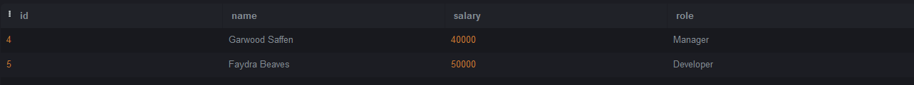

# SQL-Lab2

# We will use the Employees and Awards table below:

 

### Q1: Choose all employees who have received an award (Nested Query)?
Query:
```SQL
SELECT * FROM employee
WHERE id IN (
SELECT employee_id FROM awards
);
```

Output:
 

### Q2: Choose all employees who have never received an award (Nested Query)?
Query:
```SQL
SELECT * FROM employee
WHERE id NOT IN (
SELECT employee_id FROM awards
); 
```
Output:

 
### Q3: Choose all Developers who make more than all Managers combined (Nested Query)?
Query:
```SQL
SELECT * from employee
WHERE role = 'Developer' AND salary > (
SELECT max(salary) FROM employee
  WHERE role = 'Manager'
);
```

Output:


 
### Q4: Choose all Developers who make more money than any Manager (Nested Query)?
Query:
```SQL
SELECT * from employee
WHERE role = 'Developer' AND salary > (
SELECT salary FROM employee
  WHERE role = 'Manager'
);
```

Output:


 
### Q5: Choose all employees whose salaries are higher than the average for their position. (Nested Query)?
Query:
```SQL
SELECT * FROM employee emp
WHERE salary > (
SELECT avg(salary) FROM employee
  WHERE role = emp.role
);
```

Output:

